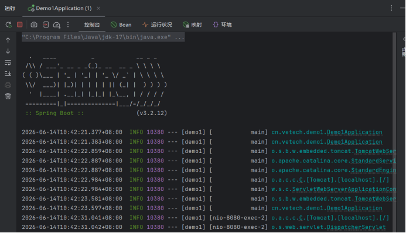
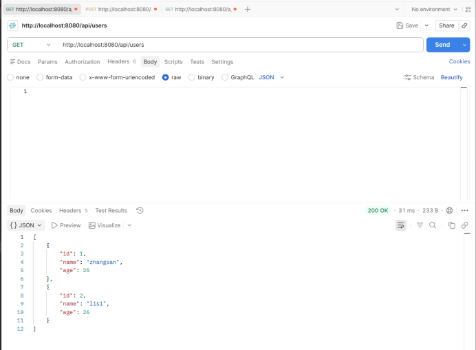
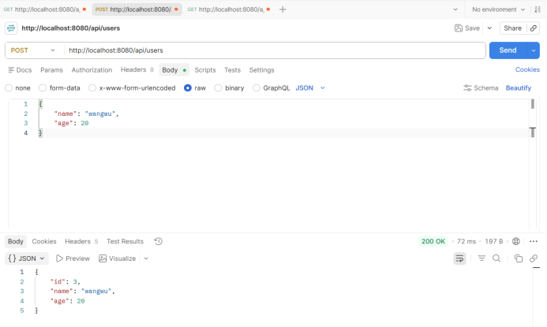
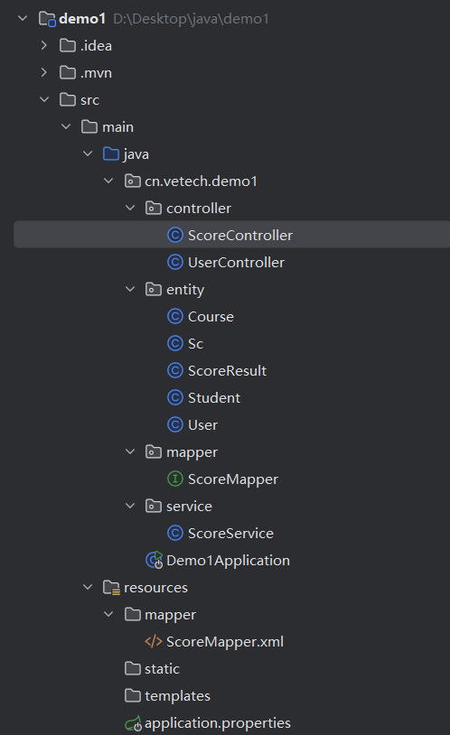
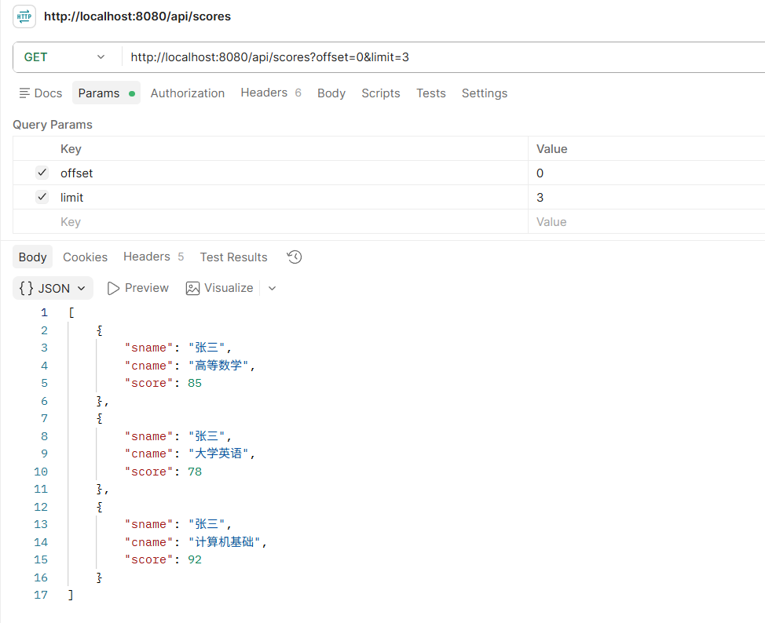
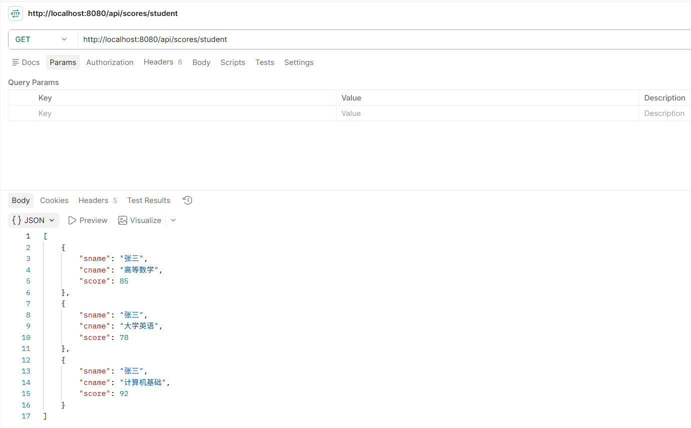
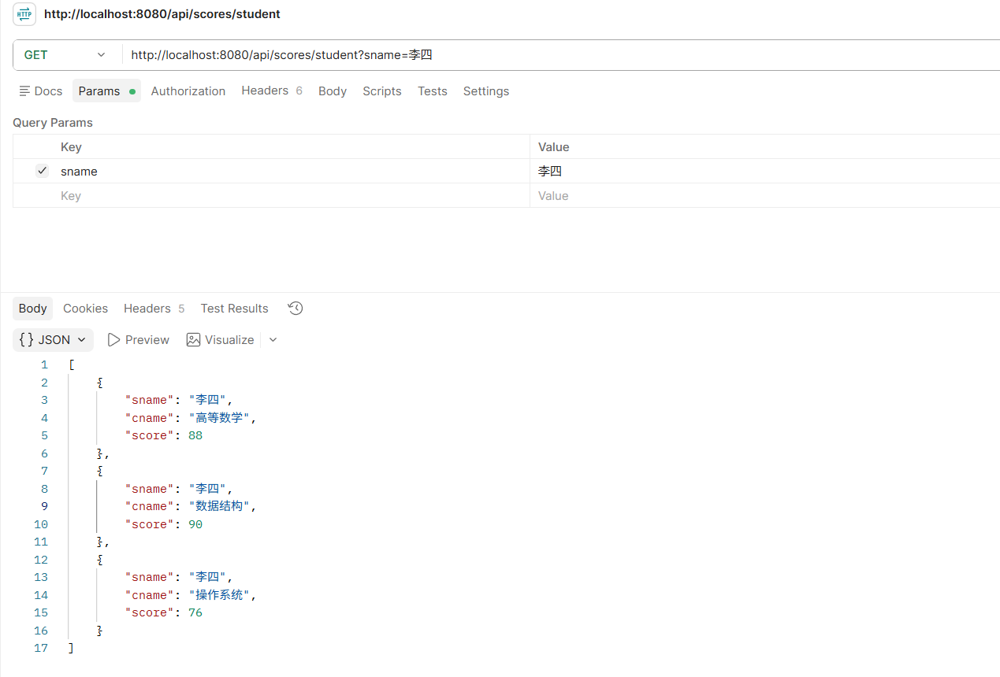
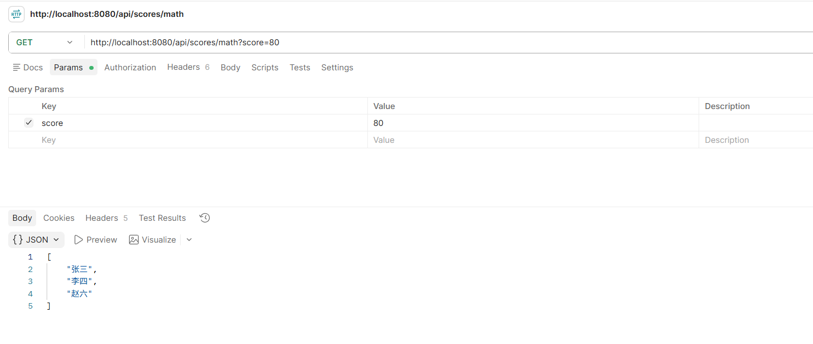

# 第二次作业

## 作业1

一. **spring工程**的搭建和成功运行

运行截图：


二. **postman**模拟请求

1. get请求
   

2. post请求
   

## 作业二

1. **数据库代码**（使用ai随机生成数据）

```mysql
CREATE DATABASE IF NOT EXISTS school;
USE school;

CREATE TABLE student (
    sid     INT PRIMARY KEY AUTO_INCREMENT,
    sname   VARCHAR(20) NOT NULL,
    age     INT,
    gender  CHAR(1)
);

CREATE TABLE course (
    cid   INT PRIMARY KEY AUTO_INCREMENT,
    cname VARCHAR(20) NOT NULL,
    tid   INT
);

CREATE TABLE sc (
    sid   INT,
    cid   INT,
    score INT,
    PRIMARY KEY (sid, cid)
);

INSERT INTO student(sname, age, gender) VALUES
('张三', 20, '男'), ('李四', 21, '女'), ('王五', 19, '男'),
('赵六', 22, '女'), ('孙七', 20, '男'), ('周八', 21, '女'),
('吴九', 19, '男'), ('郑十', 22, '女'), ('钱十一', 20, '男'),
('陈十二', 21, '女');

INSERT INTO course(cname, tid) VALUES
('高等数学', 101), ('大学英语', 102), ('计算机基础', 103),
('数据结构', 104), ('操作系统', 105);

INSERT INTO sc(sid, cid, score) VALUES
(1, 1, 85), (1, 2, 78), (1, 3, 92),
(2, 1, 88), (2, 4, 90), (2, 5, 76),
(3, 2, 60), (3, 3, 72), (3, 5, 81),
(4, 1, 95), (4, 2, 82), (4, 4, 88),
(5, 3, 70), (5, 4, 65), (5, 5, 90),
(6, 1, 55), (6, 2, 68), (6, 3, 74),
(7, 2, 91), (7, 5, 86),
(8, 1, 77), (8, 3, 83),
(9, 4, 96), (9, 5, 89),
(10, 1, 62), (10, 2, 71);
```

2. **entity** 层

(1)Course.java

```java
package cn.vetech.demo1.entity;

import com.baomidou.mybatisplus.annotation.TableName;
import lombok.*;

@Data
@NoArgsConstructor
@AllArgsConstructor
@TableName("course")
public class Course {
    private Integer cid;
    private String cname;
    private Integer tid;
}
```

(2)Sc.java

```java
package cn.vetech.demo1.entity;

import com.baomidou.mybatisplus.annotation.TableName;
import lombok.*;

@Data
@NoArgsConstructor
@AllArgsConstructor
@TableName("sc")
public class Sc {
    private Integer sid;
    private Integer cid;
    private Integer score;

}
```

(3)Student.java

```java
package cn.vetech.demo1.entity;

import com.baomidou.mybatisplus.annotation.TableName;
import lombok.*;

@Data
@NoArgsConstructor
@AllArgsConstructor
@TableName("student")
public class Student {
    private Integer sid;
    private String sname;
    private Integer age;
    private String gender;
}
```

(4)ScoreResult.java 设置json输出格式

```java
package cn.vetech.demo1.entity;

import lombok.*;

@Data   //自动生成get/set方法
@NoArgsConstructor
@AllArgsConstructor

public class ScoreResult {
    private String sname;
    private String cname;
    private Integer score;
}
```

3. **mapper**层
   ScoreMapper.java

```java
package cn.vetech.demo1.mapper;

import cn.vetech.demo1.entity.ScoreResult;
import org.apache.ibatis.annotations.Mapper;
import org.apache.ibatis.annotations.Param;
import java.util.List;

@Mapper
public interface ScoreMapper {

    List<ScoreResult> getAll(@Param("offset") int offset, @Param("limit") int limit);

    List<ScoreResult> getCnameAndScore(@Param("sname") String sname);

    List<String> getOverEighty(@Param("score") int score);

}
```

ScoreMapper.xml

```xml
<?xml version="1.0" encoding="UTF-8" ?>
<!DOCTYPE mapper PUBLIC "-//mybatis.org//DTD Mapper 3.0//EN"
        "http://mybatis.org/dtd/mybatis-3-mapper.dtd">
<mapper namespace="cn.vetech.demo1.mapper.ScoreMapper">

<!--    姓名，课程名，分数，实现分页-->
    <select id="getAll" resultType="cn.vetech.demo1.entity.ScoreResult">
        SELECT s.sname, c.cname, sc.score
        FROM student s
        JOIN sc ON s.sid = sc.sid
        JOIN course c ON sc.cid = c.cid
        LIMIT #{offset}, #{limit}
    </select>

<!--    张三的课程和成绩-->
    <select id="getCnameAndScore" resultType="cn.vetech.demo1.entity.ScoreResult">
        SELECT s.sname, c.cname, sc.score
        FROM student s
        JOIN sc ON s.sid = sc.sid
        JOIN course c ON sc.cid = c.cid
        WHERE s.sname = #{sname}
    </select>

<!--    数学大于80-->
    <select id="getOverEighty" resultType="java.lang.String">
        SELECT s.sname
        FROM student s
        JOIN sc ON s.sid = sc.sid
        JOIN course c ON sc.cid = c.cid
        WHERE c.cname = '高等数学' AND sc.score > #{score}
    </select>

</mapper>
```

4. **service**层
   ScoreService.java

```java
package cn.vetech.demo1.service;

import cn.vetech.demo1.entity.ScoreResult;
import cn.vetech.demo1.mapper.ScoreMapper;
import org.springframework.beans.factory.annotation.Autowired;
import org.springframework.stereotype.Service;

import java.util.List;

@Service
public class ScoreService {

    @Autowired  //自动注入对象，不需要自己new
    private ScoreMapper scoreMapper;

    public List<ScoreResult> getAll(int offset, int limit) {
        return scoreMapper.getAll(offset, limit);
    }

    public List<ScoreResult> getCnameAndScore(String sname){
        return scoreMapper.getCnameAndScore(sname);
    }

    public List<String> getOverEighty(int score){
        return scoreMapper.getOverEighty(score);
    }

}
```

5. **controller**层

```java
package cn.vetech.demo1.controller;

import cn.vetech.demo1.entity.ScoreResult;
import cn.vetech.demo1.service.ScoreService;
import org.springframework.beans.factory.annotation.Autowired;
import org.springframework.web.bind.annotation.*;
import java.util.List;

@RestController
@RequestMapping("/api/scores")
public class ScoreController {

    @Autowired
    private ScoreService scoreService;

    @GetMapping
    public List<ScoreResult> list(@RequestParam(defaultValue = "0") int offset,
                                  @RequestParam(defaultValue = "10") int limit) {
        return scoreService.getAll(offset, limit);
    }

    @GetMapping("/student")
    public List<ScoreResult> getCnameAndScore(@RequestParam(defaultValue = "张三") String sname) {
        return scoreService.getCnameAndScore(sname.trim()); //去字符串前后空格
    }

    @GetMapping("/math")
    public List<String> getOverEighty(@RequestParam(defaultValue = "80") int score) {
        return scoreService.getOverEighty(score);
    }

}
```

### 效果

1. 工程包的截图
   

2. 通过offset（默认设为0）和 limit(默认设为10) 实现 学生姓名，课程名，分数 分页
   

3. 查询张三的课程及对应成绩（使用自定义的ScoreResult类型输出json)
   
   
    defaultvalue = 张三，可以在url后加 ?name=~  来查询其他人的信息
    如下图：
    

4. 查询数学成绩大于80的学生姓名(使用String 存储）
   
